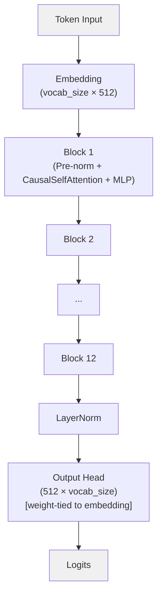
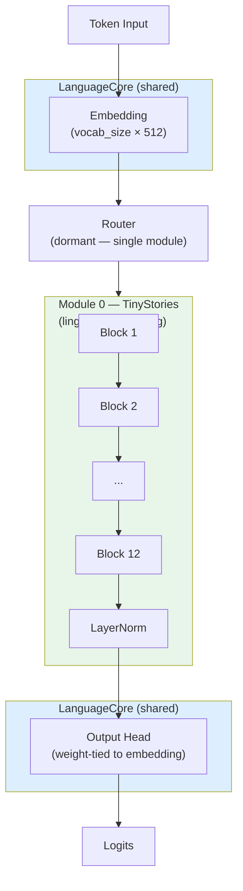
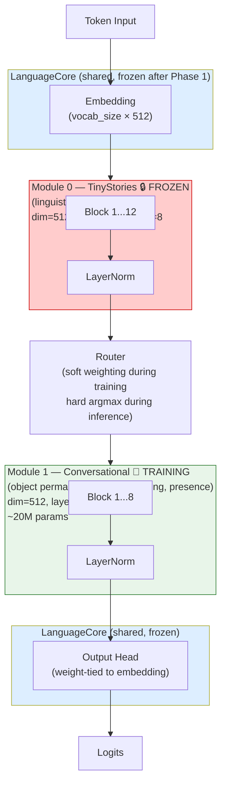
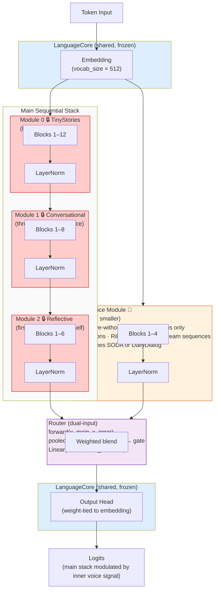

# Scout Architecture Diagrams

*Documenting Scout's architectural evolution across versions and phases.*

---

## v0 — custom-llm (monolithic GPT)

Single monolithic transformer. Trained on Victorian novels and first-person texts. No routing, no freezing, no modularity. Hit capacity limits (~70K–80K steps) causing linguistic degradation — the "seizure." The third-person narration prior from novels proved too strong for DPO to overcome.

**Parameters:** ~50M — dim=512, layers=12, heads=8, RoPE position embeddings, weight-tied embedding/output head.

---

## v2 Phase 1 — Initial single-module architecture

Scout v2 launches with a modular design from the start. A single TransformerModule (Module 0) trains on TinyStories for linguistic scaffolding. The Router exists in the architecture but is dormant — with only one module, no routing decision is needed. LanguageCore (embedding + output head) is shared across all future modules.

**Parameters:** ~50M — dim=512, layers=12, heads=8. Phase 1 corpus: SODA + DailyDialog. Trained to ~10,000 effective steps.

---

## v2 Phase 2 — Frozen linguistic base + conversational layer

After Phase 1 plateau and voice calibration pass: Module 0 and LanguageCore are frozen. Module 1 (conversational layer) is added and trained on curated conversational corpus. Router activates with soft weighting during training, hard argmax during inference.

**Key design:** Frozen Module 0 preserves linguistic structure. Module 1 learns conversational patterns on top of already-shaped representations. Router learns to weight contributions.

---

## v2 Hopeful Architecture — Horizontal inner voice module

After Module 2 (reflective layer) is trained: a parallel Inner Voice Module is added alongside the main sequential stack rather than above it. The Router is extended to accept hidden states from both streams, learning to modulate the main stack's output with the inner voice signal. The inner voice is trained exclusively on reflective-without-interlocutor corpus — never SODA or DailyDialog — so it develops a genuinely distinct representational space.

**Key insight:** The inner voice doesn't replace the conversational output — it modulates it. The Router learns to use the inner voice signal when it's informative and ignore it when it's not. If Router weights don't diverge from equal weighting during training, the inner voice isn't contributing a distinct signal — that's diagnostic information, not failure.

---

## Developmental Sequence Summary

| Phase | Module Added | Corpus | Status |
|-------|-------------|--------|--------|
| Phase 0 | Module 0 (TinyStories) | TinyStories | ✅ Complete |
| Phase 1 | Module 0 continues | SODA + DailyDialog | ✅ Complete (~10K eff. steps) |
| Voice Cal. | — | Filtered SODA + DailyDialog + scout_voice.txt | ⏳ Next |
| Phase 2 | Module 1 (Conversational) | Curated conversational | 🗓 Planned |
| Phase 3 | Module 2 (Reflective) | First-person reflective prose | 🗓 Planned |
| Phase 4 | Inner Voice (parallel) | Reflective-without-interlocutor | 🗓 Hopeful |
| Phase 5 | Module 3 (Theory of Mind) | Turn-taking, relational corpus | 🗓 Hopeful |

*Created April 24, 2026. See also: Scout_Alignment_vs_Attunement.md for inner voice design rationale.*
